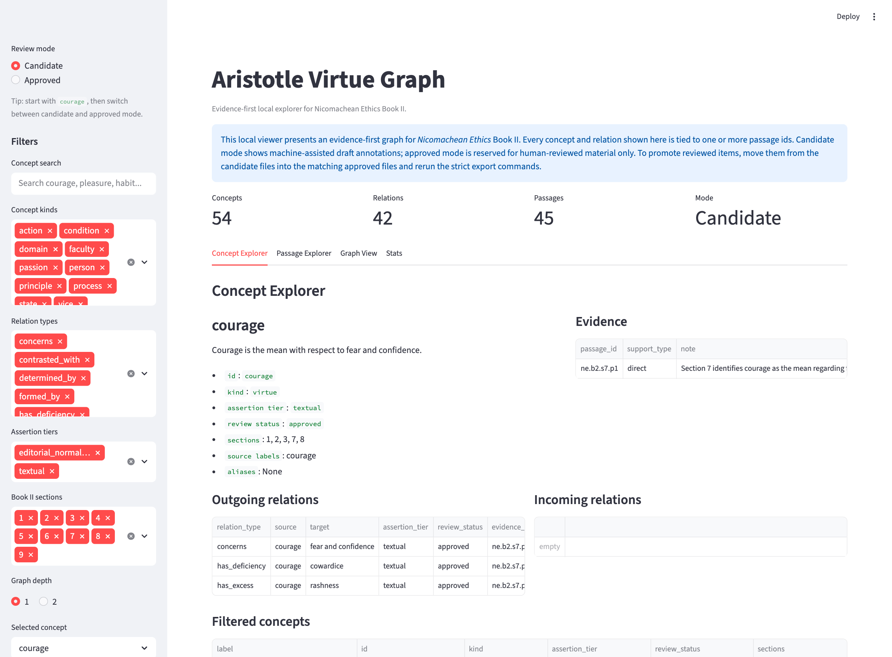

<p align="center">
  
</p>

# Aristotle Virtue Graph

> An evidence-first dashboard for exploring *Nicomachean Ethics* Book II as concepts, relations, and passages. **[Open live dashboard](https://aristotle-virtue-graph.streamlit.app/)**

This project turns Aristotle's Book II into a graph you can actually inspect.
Open a concept like `courage`, follow its linked relations, open the supporting passage, and compare the broader candidate layer against the smaller reviewed core.

🏛️ **Book II only** · 📜 **45 passages** · 🌐 **Live dashboard** · ✅ **42 approved concepts / 33 approved relations**



_Hero view: `courage` open in the dashboard, with evidence, relation tables, and the main navigation visible._

## Open the dashboard

| Live dashboard | Run locally | Viewer guide |
| --- | --- | --- |
| **[Open live dashboard](https://aristotle-virtue-graph.streamlit.app/)** | **Run now:** [`make app`](#run-the-viewer) | [Start with `courage`](docs/viewer_guide.md) |

_The live app is available on Streamlit Community Cloud. Local run instructions and deployment details remain in [docs/deployment.md](docs/deployment.md)._

## Run the viewer

```bash
python3 -m venv .venv
. .venv/bin/activate
pip install -e ".[viewer]"
make app
```

This opens the dashboard immediately with the committed Book II exports.
Start with `courage`.

## Try this first

1. Open the dashboard.
2. Keep `courage` selected.
3. Read the outgoing relations.
4. Open the supporting passage `NE II.7 p1`.
5. Switch between `candidate` and `approved` mode.

What you should see:

```text
courage
|- has_excess      -> rashness
|- has_deficiency -> cowardice
`- concerns       -> fear and confidence

evidence: NE II.7 p1
```

That one path already shows the point of the repo:
the graph is not a summary layer floating above the text.
It stays attached to the passage that supports it.

## What you can do here

- Browse Book II as a graph instead of a flat outline.
- Inspect a concept and see its evidence, labels, and linked relations.
- Open a supporting passage in one click from concept evidence or relation shortcuts.
- Start from a passage and see which concepts and relations are grounded there.
- Compare the broader candidate graph with the reviewed approved core.
- Explore a local 1-hop or 2-hop graph neighborhood around a selected concept.

## Rebuild exported data

Use this only if you want to regenerate the processed artifacts from the annotation files.

```bash
python3 -m venv .venv
. .venv/bin/activate
pip install -e ".[dev,viewer]"
make annotations-validate
make annotations-validate-strict
make annotations-export
make annotations-export-strict
make annotations-stats
```

## Why it is interesting

Book II is often reduced to a few phrases about habit and the mean.
This repo makes the internal structure more navigable:

- virtue can be explored as linked claims instead of isolated slogans
- non-hierarchical relations stay passage-grounded
- candidate and approved annotations remain visibly distinct
- textual claims, editorial normalization, and interpretation are kept separate

It is small enough to audit and concrete enough to reuse.

## Current state

| Mode | Concepts | Relations | Passages | What it gives you |
| --- | ---: | ---: | ---: | --- |
| Candidate | 54 | 42 | 45 | The broader working map for all of Book II |
| Approved | 42 | 33 | 45 | A reviewed core centered on the main practical structure |

The current reviewed core already covers:

- the distinction between moral and intellectual virtue
- habituation
- pleasure and pain as markers of formation
- virtue as a state of character rather than passion or faculty
- the conditions of virtuous action: knowledge, choice, and stability
- the mean as guided by right reason and the practically wise person
- six reviewed virtue triads:
  courage / rashness / cowardice
  temperance / self-indulgence / insensibility
  liberality / prodigality / meanness
  truthfulness / boastfulness / mock modesty
  wit / buffoonery / boorishness
  friendliness / obsequiousness / quarrelsomeness

## Viewer at a glance

| View | What it is for |
| --- | --- |
| Concept Explorer | Read one concept closely: labels, review status, evidence, and linked relations |
| Passage Explorer | Start from the text and see which concepts and relations cite that passage |
| Graph View | Inspect a 1-hop or 2-hop neighborhood without rendering the full graph as a hairball |
| Stats | See current counts, relation types, concept kinds, and review-status breakdowns |

More detail: [docs/viewer_guide.md](docs/viewer_guide.md)

## Why the structure is trustworthy

The project stays strict in a few concrete ways:

- Every concept must cite one or more passages.
- Every relation must cite one or more passages.
- `source_labels` preserve Ross wording instead of silently modernizing it.
- `candidate` and `approved` are separate files and separate export modes.
- Book II is a hard boundary; the repo does not quietly expand into later books.

## Data artifacts

Authoritative passage source:

- `data/interim/book2_passages.jsonl`

Processed candidate artifacts:

- `data/processed/book2_passages.jsonl`
- `data/processed/book2_concepts.jsonl`
- `data/processed/book2_relations.jsonl`
- `data/processed/book2_graph.json`
- `data/processed/book2_graph.graphml`
- `data/processed/book2_stats.json`

Processed approved artifacts:

- `data/processed/approved/book2_passages.jsonl`
- `data/processed/approved/book2_concepts.jsonl`
- `data/processed/approved/book2_relations.jsonl`
- `data/processed/approved/book2_graph.json`
- `data/processed/approved/book2_graph.graphml`
- `data/processed/approved/book2_stats.json`

`book2_graph.json` is the primary rich export.
`book2_graph.graphml` is a flattened interoperability export.

## Review workflow

Human-editable annotation files live in:

- `annotations/book2/concepts.candidate.yaml`
- `annotations/book2/relations.candidate.yaml`
- `annotations/book2/concepts.approved.yaml`
- `annotations/book2/relations.approved.yaml`

The working rule is simple:

- new or machine-assisted annotations begin as `candidate`
- only human-reviewed items move to `approved`
- strict export mode uses only the approved layer

This repository already includes a usable reviewed core, so approved mode is meaningful from the first run.

## Source policy

- Preferred canonical ingest source for Book II: the Ross translation on Wikisource
- Verification source: MIT Internet Classics Book II page
- MIT may be used for verification, but it is not treated as the committed canonical raw corpus
- Raw downloaded HTML stays local; the committed passage authority is the derived file
  `data/interim/book2_passages.jsonl`

Full rationale: [docs/source_policy.md](docs/source_policy.md)

## Deployment

The live dashboard is running on Streamlit Community Cloud:

- live URL: `https://aristotle-virtue-graph.streamlit.app/`
- app entrypoint: `streamlit_app.py`
- deployment dependencies: `requirements.txt`
- app theme/config: `.streamlit/config.toml`

Deployment notes and the current hosted target are in [docs/deployment.md](docs/deployment.md).

## Repository guide

- `src/aristotle_graph/ingest/`: source adapters, normalization, segmentation
- `src/aristotle_graph/annotations/`: schemas, loaders, validation, export
- `src/aristotle_graph/graph/`: graph payload construction and GraphML export
- `src/aristotle_graph/viewer/`: viewer loading, filtering, and rendering helpers
- `src/aristotle_graph/app/`: app logic
- `streamlit_app.py`: deployment-friendly root entrypoint
- `annotations/`: candidate and approved Book II annotation files
- `data/`: interim and processed outputs
- `docs/`: user and maintainer docs

Useful docs:

- [docs/viewer_guide.md](docs/viewer_guide.md)
- [docs/deployment.md](docs/deployment.md)
- [docs/annotation_guide.md](docs/annotation_guide.md)
- [docs/data_model.md](docs/data_model.md)
- [docs/source_policy.md](docs/source_policy.md)
- [docs/execplans/aristotle-virtue-graph.md](docs/execplans/aristotle-virtue-graph.md)

## Limits

- This is Book II only.
- There is no database.
- There is no chatbot or RAG layer.
- The approved subset is intentionally smaller than the candidate layer.
- Bekker references and CTS URNs are not yet populated.

## License

Code in this repository is released under the [MIT License](LICENSE).
Text provenance and redistribution constraints are described in [docs/source_policy.md](docs/source_policy.md).

## Next step

The next meaningful extension is not more software complexity.
It is more review:

- promote the remaining Book II virtue clusters from candidate to approved
- keep every promotion passage-grounded
- grow the reviewed graph without weakening the evidence standard
