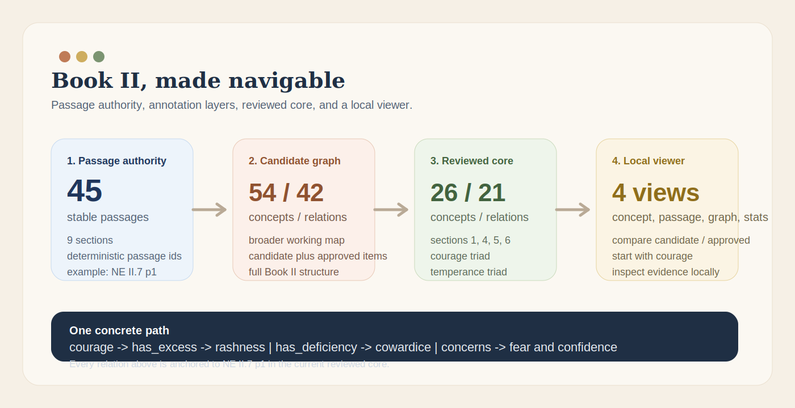

# Aristotle Virtue Graph

> Browse *Nicomachean Ethics* Book II as an auditable graph of concepts, relations, and passages.

This repository turns Book II into a local, evidence-backed graph.
You can inspect concepts like `courage` or `temperance`, follow their relations, and open the
exact passages that support each claim.

**Scope:** Book II only  
**Viewer:** local, read-only, and evidence-first  
**Reviewed core:** 26 approved concepts, 21 approved relations


_Local viewer preview: the default run now opens on `courage`, with relations and evidence in view._

## Quickstart

```bash
python3 -m venv .venv
. .venv/bin/activate
pip install -e ".[dev,viewer]"
make annotations-export
make annotations-export-strict
make app
```

This opens a local Streamlit app with Book II already loaded.
Start with `courage`.

## Try this first

Open the viewer and follow one concrete path:

1. Leave the app in `candidate` mode and keep `courage` selected.
2. Read the outgoing relations.
3. Open the supporting passage `NE II.7 p1`.
4. Switch to `approved` mode and compare the smaller reviewed core against the larger candidate layer.

What you should see:

```text
courage
|- has_excess      -> rashness
|- has_deficiency -> cowardice
`- concerns       -> fear and confidence

evidence: NE II.7 p1
```

That short path already shows what this project is for:
graph structure stays tied to the passage that justifies it.

## What you can do here

- Inspect Aristotle's virtue structure as a graph rather than a flat summary.
- Trace concepts and relations back to specific Book II passages.
- Compare tentative annotations against the reviewed subset.
- Explore Book II by concept, passage, graph neighborhood, or stats.

## Viewer capabilities

| View | What it is good for |
| --- | --- |
| Concept Explorer | Read one concept closely: labels, evidence, and incoming/outgoing relations |
| Passage Explorer | Start from the text and see which concepts and relations are grounded there |
| Graph View | Inspect a 1-hop or 2-hop neighborhood without rendering the full graph as a hairball |
| Stats | See the size and composition of the current candidate and approved layers |

More usage detail lives in [docs/viewer_guide.md](docs/viewer_guide.md).

## Why this is interesting

Book II is often reduced to a few slogans about habit and the mean.
This repo makes its structure inspectable in a more useful way:

- virtue can be explored as a set of linked claims, not isolated summaries
- every non-hierarchical relation is passage-grounded
- candidate and approved annotations remain visibly distinct
- textual claims, editorial normalization, and interpretation are not collapsed into one layer

That makes the project small enough to audit and rich enough to reuse.



## Current state

| Mode | Concepts | Relations | Passages | What it gives you |
| --- | ---: | ---: | ---: | --- |
| Candidate | 54 | 42 | 45 | The broader working map for all of Book II |
| Approved | 26 | 21 | 45 | A reviewed core centered on the main practical structure |

The current reviewed core covers:

- the distinction between moral and intellectual virtue
- habituation
- pleasure and pain as markers of formation
- virtue as a state of character rather than passion or faculty
- the conditions of virtuous action: knowledge, choice, and stability
- the mean as guided by right reason and the practically wise person
- two reviewed virtue triads:
  courage / rashness / cowardice
  temperance / self-indulgence / insensibility

## Why the repo feels trustworthy

The project stays rigorous in a few specific ways:

- Every concept must cite one or more passages.
- Every relation must cite one or more passages.
- `source_labels` preserve Ross wording instead of silently modernizing it.
- `candidate` and `approved` are separate files and separate export modes.
- Book II is the hard boundary; the repo does not quietly sprawl into later books.

This is why the repo can be accessible without becoming hand-wavy.

## Data and outputs

Authoritative passage source:

- `data/interim/book2_passages.jsonl`

Processed candidate artifacts:

- `data/processed/book2_passages.jsonl`
- `data/processed/book2_concepts.jsonl`
- `data/processed/book2_relations.jsonl`
- `data/processed/book2_graph.json`
- `data/processed/book2_graph.graphml`
- `data/processed/book2_stats.json`

Processed approved artifacts:

- `data/processed/approved/book2_passages.jsonl`
- `data/processed/approved/book2_concepts.jsonl`
- `data/processed/approved/book2_relations.jsonl`
- `data/processed/approved/book2_graph.json`
- `data/processed/approved/book2_graph.graphml`
- `data/processed/approved/book2_stats.json`

`book2_graph.json` is the primary rich export.
`book2_graph.graphml` is a flattened interoperability export.

## Review workflow

Human-editable annotation files live in:

- `annotations/book2/concepts.candidate.yaml`
- `annotations/book2/relations.candidate.yaml`
- `annotations/book2/concepts.approved.yaml`
- `annotations/book2/relations.approved.yaml`

The working rule is simple:

- new or machine-assisted annotations begin as `candidate`
- only human-reviewed items move to `approved`
- strict export mode uses only the approved layer

This repository already includes a usable reviewed core, so approved mode is meaningful from the first run.

## Source policy

- Preferred canonical ingest source for Book II: the Ross translation on Wikisource
- Verification source: MIT Internet Classics Book II page
- MIT may be used for verification, but it is not treated as the committed canonical raw corpus
- Raw downloaded HTML stays local; the committed passage authority is the derived file
  `data/interim/book2_passages.jsonl`

See [docs/source_policy.md](docs/source_policy.md) for the fuller rationale.

## Repository guide

- `src/aristotle_graph/ingest/`: source adapters, normalization, segmentation
- `src/aristotle_graph/annotations/`: schemas, loaders, validation, export
- `src/aristotle_graph/graph/`: graph payload construction and GraphML export
- `src/aristotle_graph/viewer/`: viewer loading, filtering, and rendering helpers
- `src/aristotle_graph/app/`: Streamlit entrypoint
- `annotations/`: candidate and approved Book II annotation files
- `data/`: interim and processed outputs
- `docs/`: user and maintainer docs

Useful docs:

- [docs/viewer_guide.md](docs/viewer_guide.md)
- [docs/annotation_guide.md](docs/annotation_guide.md)
- [docs/data_model.md](docs/data_model.md)
- [docs/source_policy.md](docs/source_policy.md)
- [docs/execplans/aristotle-virtue-graph.md](docs/execplans/aristotle-virtue-graph.md)

## Limits

- This is Book II only.
- There is no database.
- There is no chatbot or RAG layer.
- The approved subset is intentionally smaller than the candidate layer.
- Bekker references and CTS URNs are not yet populated.

## License

Code in this repository is released under the [MIT License](LICENSE).
Text provenance and redistribution constraints are described in [docs/source_policy.md](docs/source_policy.md).

## Next step

The next meaningful extension is not more software complexity.
It is more review:

- promote the remaining Book II virtue clusters from candidate to approved
- keep every promotion passage-grounded
- grow the reviewed graph without weakening the evidence standard
