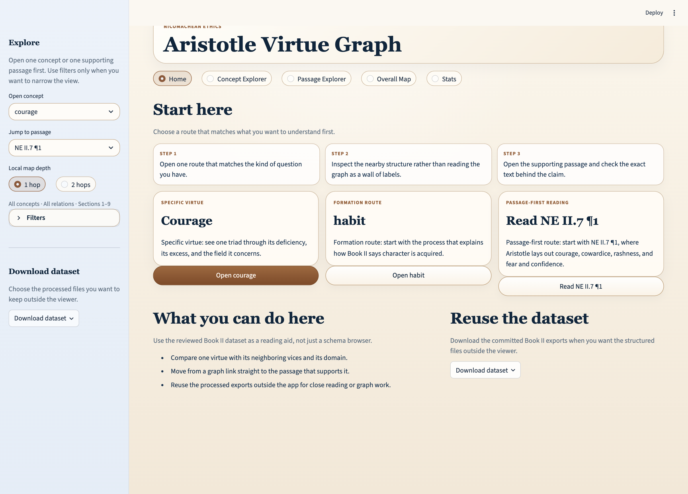
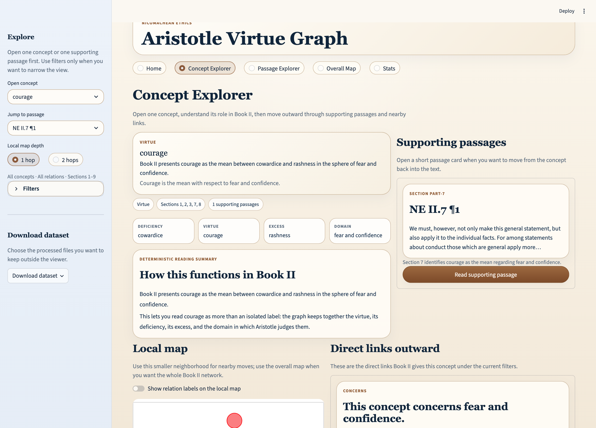

# Viewer Guide

The local viewer is the fastest way to understand what this repository is for.
It now opens directly into the reviewed Book II dataset.



## Start here

If you only want to open the viewer against the committed exports:

```bash
python -m venv .venv
. .venv/bin/activate
pip install -e ".[viewer]"
make app
```

If you want to rebuild the reviewed exports first:

```bash
python -m venv .venv
. .venv/bin/activate
pip install -e ".[dev,viewer]"
make annotations-validate
make annotations-validate-strict
make annotations-export
make app
```

Once the app opens, start with `courage`.

## Suggested first walkthrough

1. Land on `Home`.
2. Open `courage`.
3. Read the top concept panel, the triad strip, and the Book II summary.
4. Open the linked supporting passage `NE II.7 ¶1`.
5. Use the local map on the same page, or switch to `Overall Map`, and click a nearby node to jump into its concept page.

This is the quickest way to see how the project works:
the graph is navigable, but every claim stays attached to the passage that supports it.

## What each view is for

### Home

Use this for the fastest entry points.

It gives you:

- a compact `Start here` block with a short three-step reading path
- a specific virtue route through `courage`
- a formation route through `habituation`
- a passage-first route through `NE II.7 ¶1`, which opens the courage triad from the text side
- a dataset chooser for the full bundle or any single processed file

### Concept Explorer

Use this when you want to understand one concept well.



It shows:

- a top concept panel with the concept's role in Book II and a short descriptive line
- compact metadata pills for kind, sections, and supporting-passage count
- a triad strip for virtues that have deficiency, excess, and domain structure
- a deterministic summary of how that concept functions in Book II
- a compact clickable local map around the selected concept
- readable relation cards with one-click concept and passage jumps
- supporting passage previews
- an optional `Dataset details` section for ids, source labels, tiers, and structured tables

### Passage Explorer

Use this when you want to start from the text.

It shows:

- previous and next passage buttons based on the currently filtered sequence
- a reading panel for the full passage text
- linked concept cards as buttons back into Concept Explorer
- linked relations grounded in that passage, phrased in human-readable sentences

### Overall Map

Use this when you want the whole filtered Book II network in one place.

It shows:

- visible concept and relation counts for the current map
- the full filtered node-edge map, not just one local neighborhood
- optional edge labels and isolated-node toggles in a compact control row
- a selected-concept context panel below the map
- top connected concepts in the current filtered view
- the relation mix in a lower expander
- node click-through into Concept Explorer

### Stats

Use this for a quick sense of scale:

- top-line counts for passages, concepts, relations, and relation types
- concept-kind breakdowns
- relation-type breakdowns
- assertion-tier breakdowns

## What to look for

The viewer is most useful when you ask concrete questions such as:

- What exactly does Book II connect courage to?
- Where is this claim grounded in the passage sequence?
- How does Aristotle move from habituation to virtue, pleasure, pain, and the mean?
- Which concepts become clearer when you start from the passage instead of from the graph?
